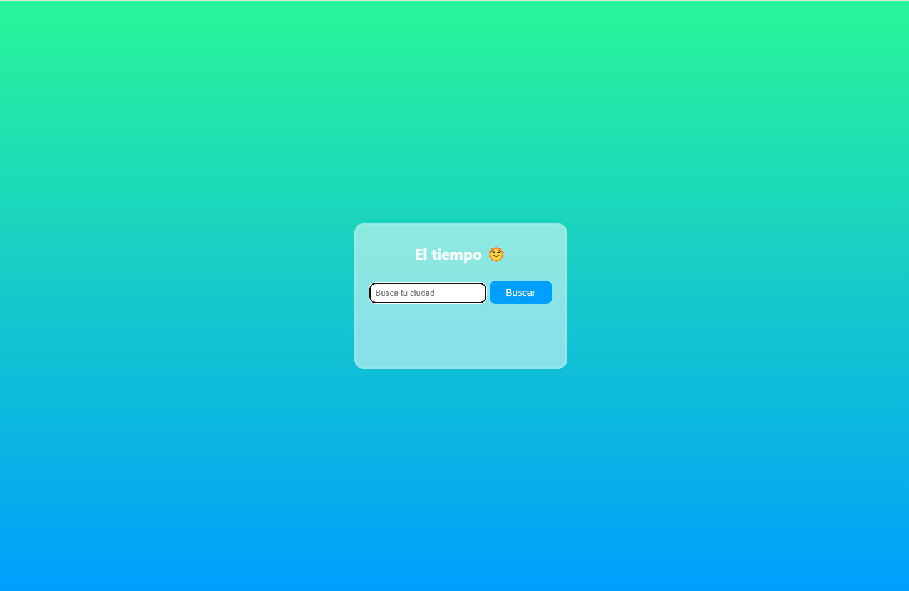
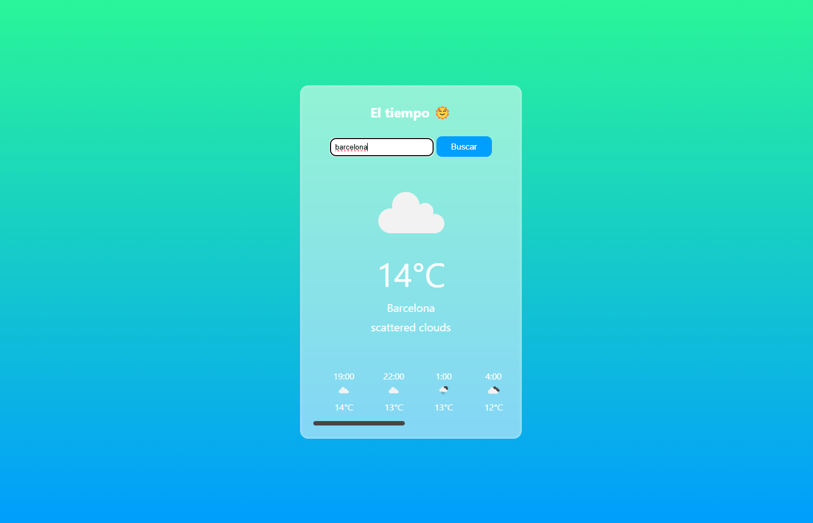
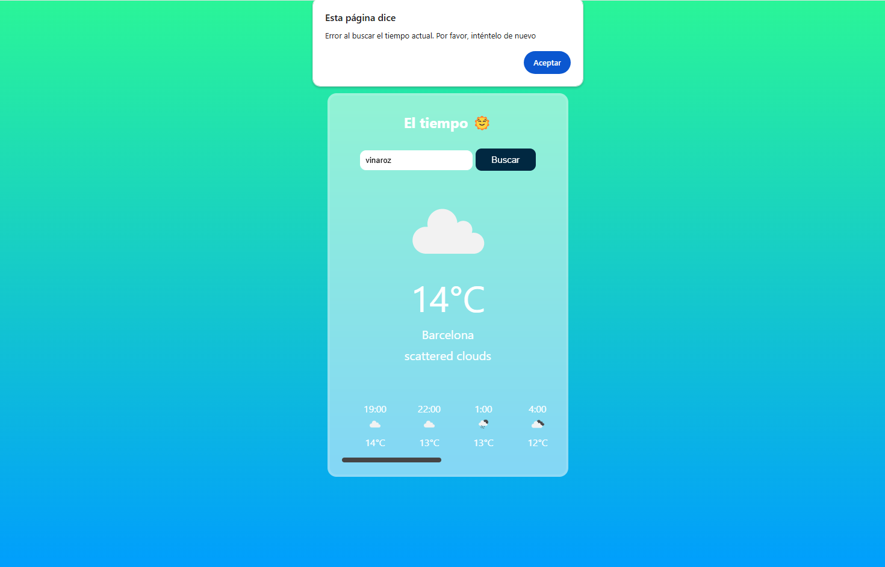

<h1>Weather App</h1>

  

 
Ejercicio autodidactico,
 

  

 
Una app funcional donde puedees ver el tiempo real en el momento actual 
Esta conectada a la API, de openweathermap 
Abqajo cargan las proximas horas todo con javaScript un maximo de 8 recuadraso 
Se usa tecnologias Js,html,css uso de API 
Es responsive. 🧮
 

<h3>ALGUNAS IMAGENES </h3>   
<h4 align= "left"> 🔵 Asi se ve la app al entrar </h4>   
     
  <h4 align= "left"> 🔵 Al buscar una ciudad son el slider abajo de 3 horas</h4>   
    
  <h4 align= "left"> 🔵 Cuando introduces mal el numbre de una ciudad, en vacio o no existe en la BBDD sale una alert</h4>   
    

  
 
 
<h6>Gracias por visitar el repo 💪 </h6>
<h6>Ejercicio de: <a href="https://www.youtube.com/watch?v=74IOjtVvExY">Devression</a> </h6>
